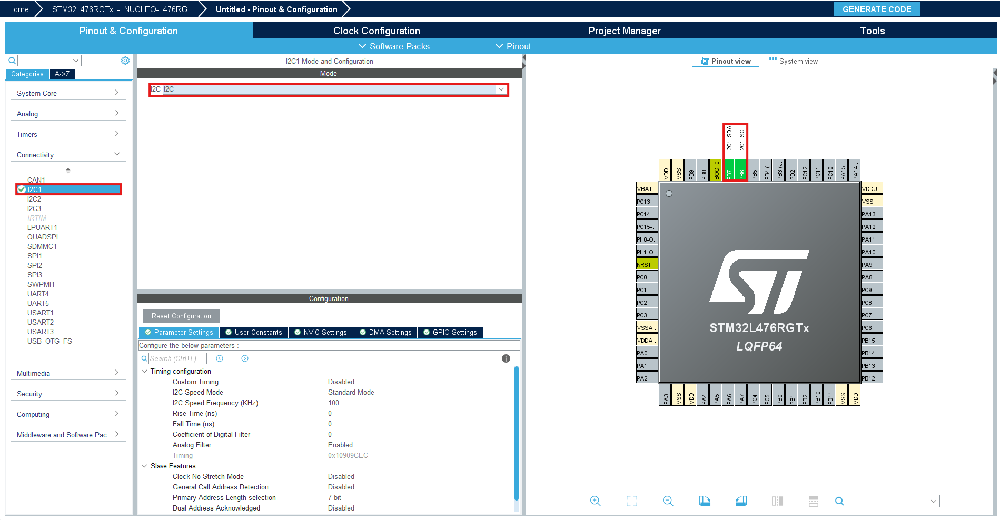
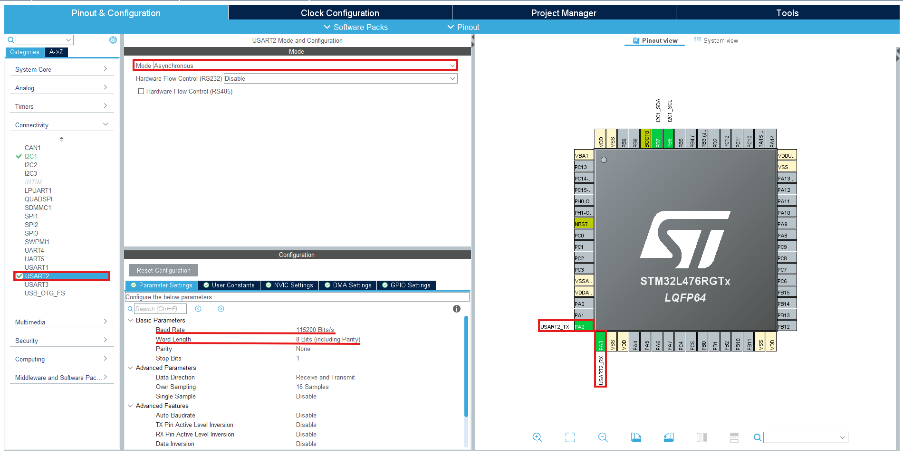
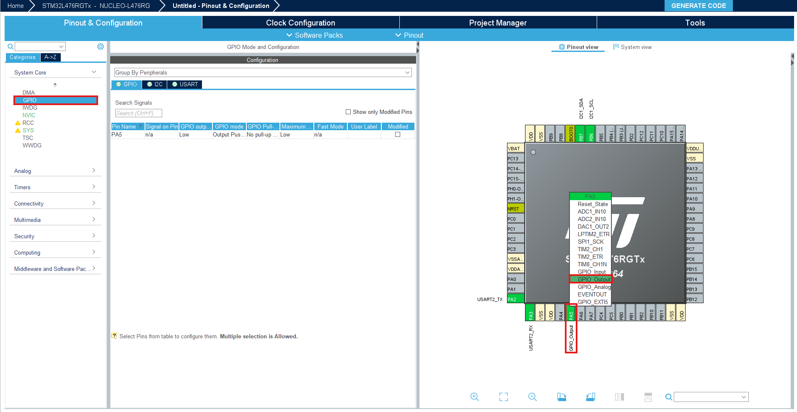
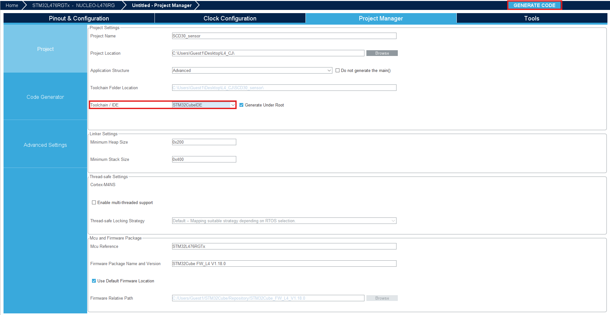
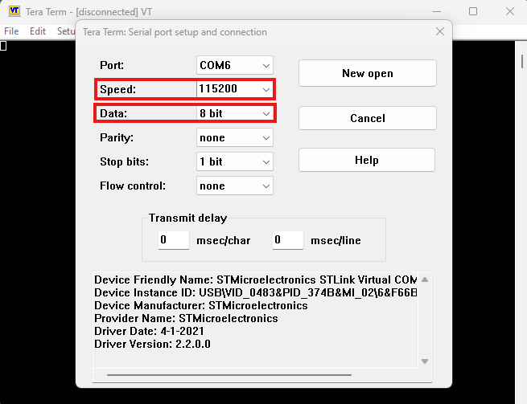
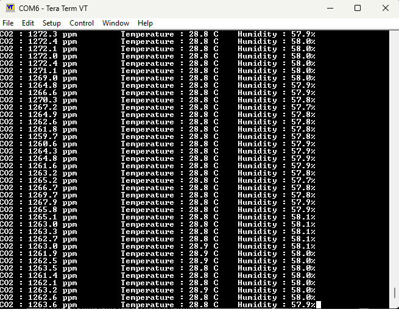

# STM32L4 SCD30 CO2 Sensor Interface

This repository contains a C code implementation for interfacing the Sensirion SCD30 CO2 sensor with the STM32L4 microcontroller. The sensor is connected using I2C, and sensor data (CO2 concentration, humidity, and temperature) is transmitted via UART to a terminal application like Tera Term.

## Table of Contents

- [Overview](#overview)
- [Dependencies](#dependencies)
- [STM32CubeMX](#stm32cubemx)
- [Setup](#setup)
- [Usage](#usage)
- [Results](#results)
- [Contributing](#contributing)
- [License](#license)
- [Contact](#contact)

## Overview

This project implements the integration of the Sensirion SCD30 CO2 sensor with the STM32L4 microcontroller using a single-file C code approach [main.c](https://github.com/cherifon/STM32_SDC30_CO2_Sensor/blob/main/SCD30_sensor/Core/Src/main.c). The code establishes communication with the sensor via the I2C protocol to collect environmental data, which is then transmitted over UART for real-time monitoring and analysis through a terminal interface.

## Dependencies

To build and run the project, ensure the following dependencies are met:

- STM32CubeIDE or STM32CubeMX for STM32L4 firmware development
- Tera Term or other UART terminal software for receiving sensor data

## STM32CubeMX

#### Download and Install STM32CubeMX

1. Download STM32CubeMX from the [STMicroelectronics website](https://www.st.com/en/development-tools/stm32cubemx.html).
2. Install STM32CubeMX following the provided installation instructions.

#### Opening a Project

1. Launch STM32CubeMX after installation.
2. Create a new project or open an existing one where you intend to configure the STM32L4 microcontroller.

### Configuring I2C Interface

#### Step 1: Adding I2C Peripheral

1. Click on the "Pinout & Configuration" tab.
2. Navigate to the "Connectivity" section.
3. Click on "I2C1" to add the I2C peripheral.

#### Step 2: Configuring I2C Parameters

1. Click on the newly added I2C1 peripheral to configure its parameters.
2. Set the I2C Mode to "I2C".

### Configuring UART Interface

#### Step 3: Adding UART Peripheral

1. Click on "USART2" under "Connectivity" to add the UART peripheral.

#### Step 4: Configuring UART Parameters

1. Click on the newly added "USART2" peripheral to configure its parameters.
2. Set the UART Mode to "Asynchronous".

### Configuring GPIO (LED2) Pin

#### Step 5: Adding GPIO Pin

1. Click on "PA5" or any desired GPIO pin to configure it for LED2.

#### Step 6: Configuring GPIO Parameters

1. Set the GPIO Pin Mode to "Output".

### Generating Code

1. After configuring I2C, UART, and GPIO settings, click on the "Project", then "Settings" tab.
2. Set the toolchain/IDE to be used (e.g., STM32CubeIDE).
3. Click "Generate Code" to generate the code for your STM32L4 project.

### Importing Generated Code into Your IDE

1. Open your preferred STM32 IDE (e.g., STM32CubeIDE).
2. Import the project by selecting the folder where you generated the code.
3. Build and flash the code onto your STM32L4 microcontroller.

## Setup

1. **Hardware Setup:**
   - Connect the SCD30 CO2 sensor to the STM32L4 microcontroller using the I2C interface.
   - Ensure proper power and ground connections.

2. **Software Setup:**
   - Import the [main.c](https://github.com/cherifon/STM32_SDC30_CO2_Sensor/blob/main/SCD30_sensor/Core/Src/main.c) file into your STM32CubeIDE project or use it directly with your preferred STM32 development environment.
   - Configure the UART interface settings according to your setup (baud rate, parity, etc.).

## Usage

1. **Build and Flash:**
   - Compile the code [main.c](https://github.com/cherifon/STM32_SDC30_CO2_Sensor/blob/main/SCD30_sensor/Core/Src/main.c) using your STM32 development environment.
   - Flash the compiled firmware onto the STM32L4 microcontroller.

2. **Terminal Setup:**
   - Open Tera Term or a compatible terminal application on your computer.
  
   
   Make sure that the speed is at 115200 Bits/s and the data is at 8 bit.

4. **Monitor Sensor Data:**
   - Configure Tera Term to receive UART data from the STM32L4 microcontroller.
   - Power on the setup and observe CO2 concentration, humidity, and temperature readings in real-time.
  
## Results

After setting up and running the code on the STM32L4 microcontroller, you should be able to see the following results:

1. **CO2, Temperature, and Humidity Data:**
   - The SCD30 sensor will capture CO2 concentration, temperature, and humidity data.
   - This data will be transmitted via the UART interface.

2. **Displaying Data on Terminal:**
   - Open Tera Term or any other terminal emulator.
   - Connect to the corresponding UART port.
   - You should see the CO2, temperature, and humidity readings displayed on the terminal in real-time.
  
   

3. **LED2 Status:**
   - The LED2 connected to the GPIO pin (e.g., PA5) can be used to indicate various statuses, such as data transmission or sensor activity.

## Resources

For more information about the SCD30 sensor, refer to the [Sensirion SCD30 Product Page](https://sensirion.com/products/catalog/SCD30/).

## Contributing

Contributions are welcome! Fork the repository, make your changes in [main.c](https://github.com/cherifon/STM32_SDC30_CO2_Sensor/blob/main/SCD30_sensor/Core/Src/main.c), and submit a pull request. Please adhere to code style guidelines and ensure compatibility with the STM32L4 platform.

## License

This project is licensed under the MIT License - see the [LICENSE](LICENSE) file for details.

## Contact

For questions or suggestions, contact [cherifjebali0301@gmail.com](mailto:cherifjebali0301@gmail.com).
